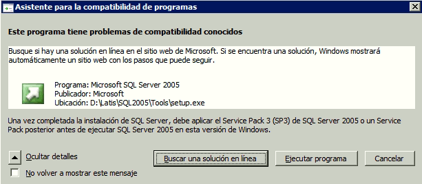
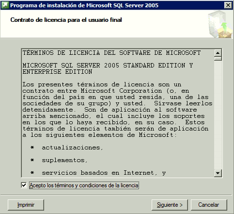

# Instalar SQL Server 2005

Instalación de SQL Server 2005 para Latis

- Al iniciar la instalación, si aparece el `Siguiente` mensaje hacer click en `Ejecutar programa`

Aceptar los términos u condiciones y hacer click en `Siguiente` para continuar.

Si no hay ningún error hacer click en ``Siguiente`` .

fig 1a SQL Server
Hacer click en `Siguiente`.

fig 2 SQL Server
Presionar `Siguiente`.

Llenar la información de registro.

fig 3 SQL Server
Presionar `Siguiente` para comenzar.

La instalación recomendada es la indicada a continuación

Servicios de bases de datos
Hacer click en Avanzadas.

Seleccionar Archivo de datos.

fig 3 SQL Server
Y hacer click en Examinar

En Windows, crear una carpeta SQLData en el disco duro donde se va a montar la base de datos.
Ej: C:\SQLData

fig 10 SQL Server
Y Seleccionarla como Ruta de instalación. y hacer click en Aceptar.

Seleccionar la instancia predeterminada.fig 4 SQL Server
Y darle `Siguiente`
Seleccionar la cuenta del sistema.fig 5 SQL Server
Y darle `Siguiente`.

Seleccionar el Modo de autenticación Mixto

fig 6 SQL Server
Escribir la contraseña para el usuario SA de SQL Server.

IMPORTANTE: Para que Latis/Pro funcione correctamente se debe seleccionar el Modo mixto

Darle `Siguiente`
Se debe el "collation" o "intercalación" Latin1_General y "Distingue acentos"

fig 7 SQL Server
Darle `Siguiente`
fig 7 SQL Server
Darle `Siguiente`

fig 7 SQL Server
Esperar a que termine la instalación

Dependiendo de la versión de Windows puede aparecer el `Siguiente` mensaje

fig 7 SQL Server
Darle click en Ejecutar programa

Una vez instalados todos los componentes

fig 7 SQL Server
Darle click en `Siguiente`

fig 7 SQL Server
Darle click en Finalizar