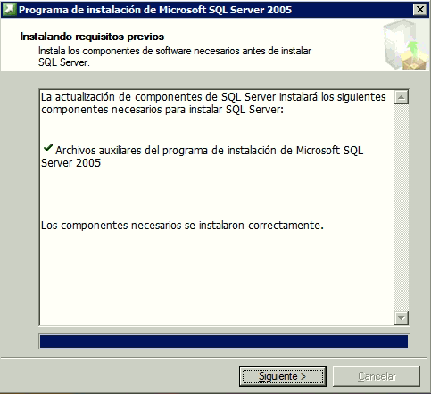

# Instalar SQL Server 2005

Instalación de SQL Server 2005 para Latis

- Al iniciar la instalación, si aparece el siguiente mensaje hacer click en <kbd>Ejecutar programa</kbd>


- Aceptar los términos u condiciones y hacer click en <kbd>Siguiente</kbd> para continuar.




- Si no hay ningún error hacer click en <kbd>Siguiente</kbd> .


- Hacer click en <kbd>Siguiente</kbd>.


- Presionar <kbd>Siguiente</kbd>.

- Llenar la información de registro.
  


- Presionar <kbd>Siguiente</kbd> para comenzar.


>La instalación recomendada es la indicada a continuación:

- Servicios de bases de datos
- Hacer click en <kbd>Avanzadas</kbd>.

- Seleccionar Archivo de datos.


- Y hacer click en <kbd>Examinar</kbd>

En Windows, crear una carpeta SQLData en el disco duro donde se va a montar la base de datos.
```
Ej: C:\SQLData
```


- Y seleccionar la como Ruta de instalación. Y hacer click en <kbd>Aceptar</kbd>.


- Seleccionar la instancia predeterminada
- Y darle <kbd>Siguiente</kbd>
  


- Seleccionar la cuenta del sistema.
- Y darle <kbd>Siguiente</kbd>.


> **IMPORTANTE**: Para que Latis/Pro funcione correctamente se debe seleccionar el Modo mixto.

- Seleccionar el Modo de autenticación Mixto
- Escribir la contraseña para el usuario **SA** de SQL Server.
- Darle <kbd>Siguiente</kbd>
    


- Se debe seleccionar el "collation" o "intercalación" Latin1_General y "Distingue acentos"
- Darle <kbd>Siguiente</kbd>
  


- Esperar a que termine la instalación

Dependiendo de la versión de Windows puede aparecer el 
siguiente mensaje:


- Darle click en <kbd>Ejecutar programa</kbd>

Una vez instalados todos los componentes


- Darle click en <kbd>Siguiente</kbd>


- Darle click en <kbd>Finalizar</kbd>

[Volver a Línea base](../Linea_Base.md)