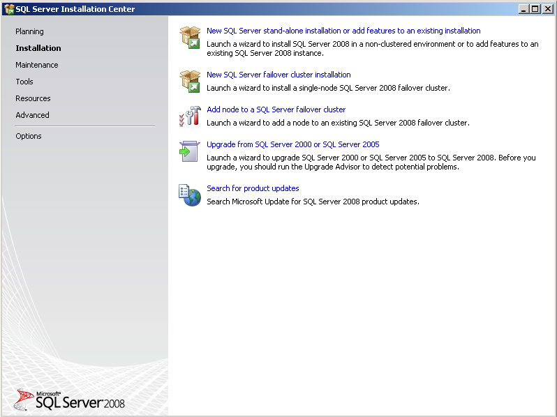

# Instalar SQL Server 2008 Express/2008R2 Express

Para la instalación de SQL Server 2008 Express

- Descargar el archivo de instalación adecuado según el idioma del sistema operativo y la arquitectura.
  - Si Windows está en español descargar la de español.
  - Si Windows es de 32Bits descargar x86 si es de 64bits usar el x64.

```
Ej: SQLEXPR_x86_ENU.exe 
```
Es para la versión de 32bits en Ingles.


## Instalación desatendida

Si se tiene preparado un archivo de Configuración se puede instalar en modo desatendido usando el siguiente comando

### SQL2008 Express

SQLEXPR_x86_ENU.exe /QS /ConfigurationFile="C:\xxx\ConfigurationFile.ini"
Donde C:\xxx es la ruta donde se encuentra el archivo de configuración.

### SQL2008 R2 Express

```powershell
SQLEXPR_x86_ENU.exe /IAcceptSQLServerLicenseTerms /QS /ConfigurationFile="C:\xxx\ConfigurationFile.ini"
```
Donde **C:\xxx** es la ruta donde se encuentra el archivo de configuración.
El archivo de configuración se puede descargar [aquí](https://www.latispro.com/integradores/Curso/ConfigurationFile.zip).

## Instalación de SQL Server Management Studio

La instalación de SQL Server Express sólo viene el "manejador" de base de datos, si se necesita realizar alguna otra tarea de base de datos (como adjuntar una base de datos, o ejecutar alguna consulta) se requiere la instalación de esta herramienta.

Se deben seguir los siguientes pasos:

- Descargar y ejecutar **SQLManagemenrStudio_x86.exe** para máquinas de 32 btis o **SQLManagemenrStudio_x64.exe** para máquina de 64 bits





[Volver a Línea base](../Linea_Base.md)