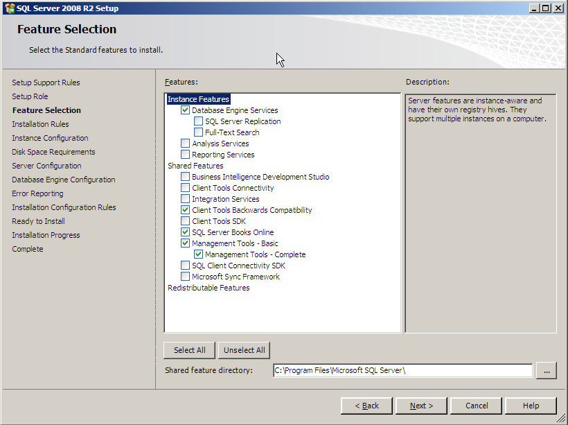

# Instalar SQL Server 2008 R2


- Seleccionar nueva <kbd>Instalación</kbd> ó <kbd>Installation</kbd>.

  

- Después de las pruebas darle <kbd>Ok</kbd> para continuar.

  
- Luego de introducir el Product key hacer click en <kbd>Install</kbd>
- Si no hay ningún error hacer click en <kbd>Siguiente</kbd>.

  
- Seleccionar características de SQL y presionar <kbd>Siguiente</kbd>.
  
- Seleccionar Base de datos y Herramientas de cliente. Como se muestra a continuación.
  
  

- Y darle <kbd>Siguiente</kbd>.

- En Windows, crear una carpeta **SQLData** en el disco duro donde se va a montar la base de datos.
  ```
  Ej: C:\SQLData
  ```
  


- En la pantalla de configuración de la Instancia cambiar la ruta a la carpeta **SQLData** y dejar la instancia por defecto.
  
  

- Y darle <kbd>Siguiente</kbd>
  
- En la Configuración de Servidor, seleccionar las cuentas de los servicios de SQL.

  

- En el collation seleccionar **SQL_Latin1_General_CP1_CI_AS**
  
  

Darle <kbd>Siguiente</kdb>.

- En la Configuración de Database Engine Seleccionar **Modo mixto** de autenticación y establecer la contraseña del usuario SA. Adicionalmente agregar el usuario actual como administrador.
  
   

   > **IMPORTANTE**: Para que Latis/Pro funcione correctamente se debe seleccionar el Modo mixto.

- Darle <kbd>Siguiente</kbd>, <kbd>Siguiente</kbd> y luego <kbd>Instalar</kbd>.

[Volver a Línea base](../Linea_Base.md)