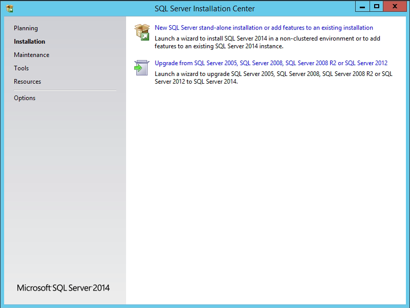
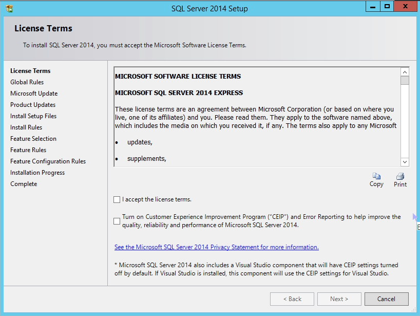
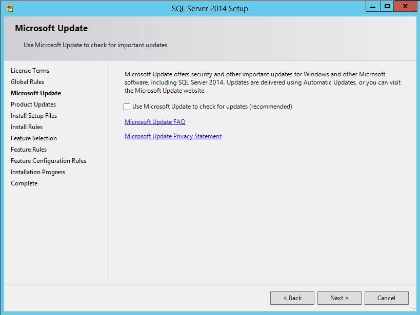
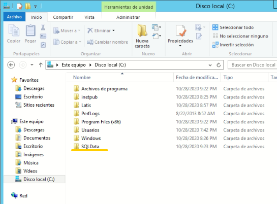
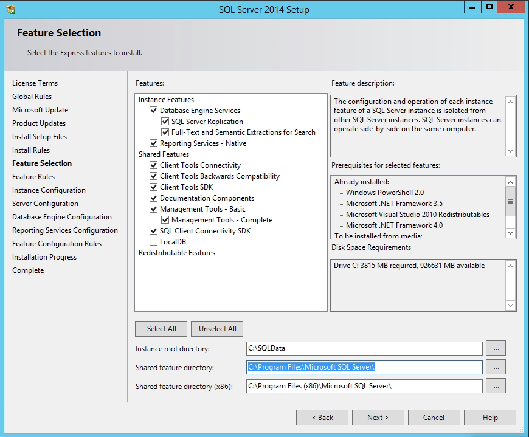
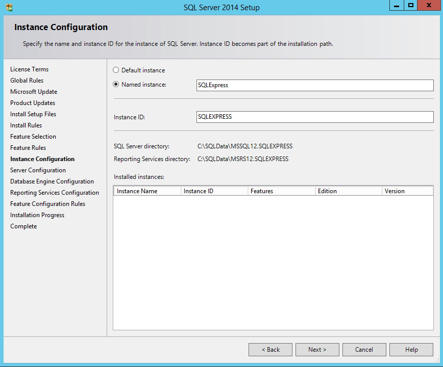
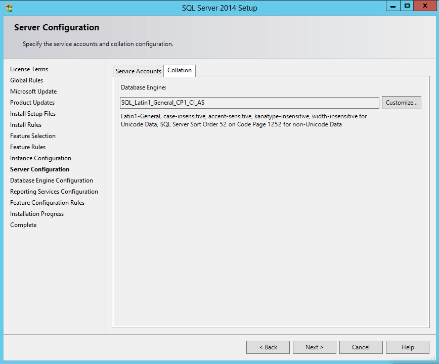
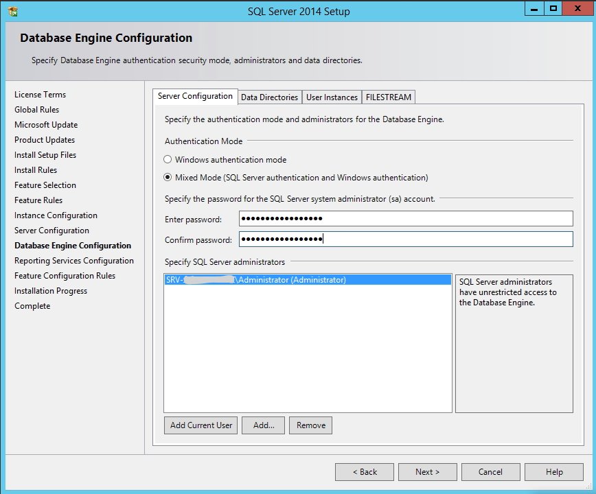
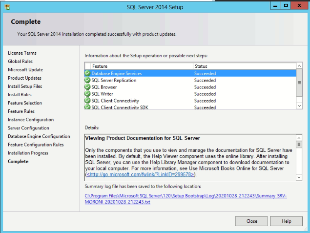

# Instalar SQL Server 2014 Express

Para la instalación de SQL Server 2014 Express:

- Descargar el archivo de instalación adecuado según el idioma del sistema operativo y la arquitectura.

  - Si Windows está en español descargar la de español.
  - Si Windows es de 32Bits descargar x86 si es de 64bits usar el x64.

```
Ej: SQLEXPR_x86_ENU.exe
```
Es para la versión de 32 bits en Ingles.

- Seleccionar "Nueva instalación"
  


  

- Aceptar la licencia y darle <kbd>Siguiente</kbd>

  

- Darle <kbd>Siguiente</kbd>

- En Windows, crear una carpeta **SQLData** en el disco duro donde se va a montar la base de datos.

```
Ej: C:\SQLData
```

  

  

- Cambiar el Instance root Directory a SQLData

  

- <kbd>Siguiente</kbd> en el nombre de la instacia de SQL Server.

  

- Seleccionar **SQL_Latin1_General_CP1_CI_AS** en el Collation.

  

> **IMPORTANTE**: se debe seleccionar **Modo mixto** y establecer una contraseña, para que la configuración de Latis sea correcta.


- Darle <kbd>Siguiente</kbd>

  

- Darle <kbd>Close</kbd> para finalizar.

[Volver a Línea base](../Linea_Base.md)